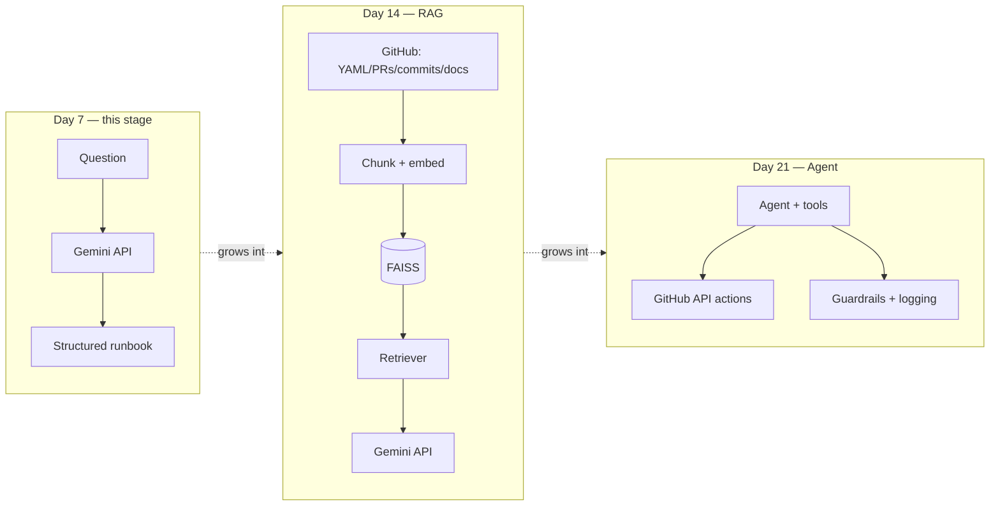

# 🚀 AI-Powered DevOps Release Assistant

**A single assistant, growing across a 3-week AI/GenAI course — from a plain LLM Q&A tool (Day 7) to a RAG-powered retriever (Day 14) to a full agentic system with tools, security, and MCP (Day 21).**

> Part of the [21-day AI For DevOps course](https://github.com/saghosh8/AI-For-DevOps) — this repo is the hands-on project, with milestones added on Day 7, Day 14, and Day 21. If anything here is unclear, check the course repo first for the day-by-day writeups.

[](https://github.com/saghosh8/ai-devops-release-assistant/actions/workflows/tests.yml)
[](https://www.python.org/)
[](https://ai.google.dev/)
[](https://github.com/saghosh8/ai-devops-release-assistant/releases/tag/v0.1-day7)

---

## The three-milestone arc

This repo is intentionally **one evolving codebase**, not three separate projects. Each milestone is tagged so the growth is visible in the git history — which is the point: the same assistant gains capabilities each week rather than being rebuilt from scratch.

| Tag | Week | What it adds | Status |
| --- | ---- | ------------- | ------ |
| [`v0.1-day7`](https://github.com/saghosh8/ai-devops-release-assistant/releases/tag/v0.1-day7) | Week 1 | Plain LLM Q&A → structured runbook (this README describes this stage) | ✅ Current |
| `v0.2-day14` | Week 2 | RAG: ingest real GitHub docs/PRs/commits/YAML → chunk → embed → FAISS → retrieve → answer with Gemini | 🔜 Planned |
| `v1.0-day21` | Week 3 | Full agent: tool-use against the real GitHub API, prompt-injection/PII guardrails, cost/latency logging, MCP server exposing this assistant's tools | 🔜 Planned |



See [`ROADMAP.md`](ROADMAP.md) for exactly what Day 14 and Day 21 will add, module by module.

---

## What this stage (Day 7) is

A small Python CLI that asks Gemini a DevOps question and gets back a **structured runbook** — summary, root cause, ordered steps, runnable commands, best practices, references — instead of a paragraph. It's designed to be run two ways:

1. **Locally**, as a CLI, for development and testing.
2. **Entirely inside GitHub**, via a `workflow_dispatch` Action — type a question into the Actions tab, get the answer formatted directly into the run summary. No hosting, no server, no exposed API key.

## Why it's built this way

This is the Day 7 capstone for a Week 1 course on LLM & GenAI foundations. Rather than a nice chat UI that hides the mechanics, this project is built so each earlier day is visible somewhere in the code:

| Day | Topic | Where it shows up |
| --- | ----- | ------------------ |
| 1 | AI vs ML vs DL, Generative AI, LLMs, training vs inference, LLM limitations | *(conceptual — see [Day 1 & 2 concepts](#day-1--2-concepts-not-code-by-nature) below)* |
| 2 | Tokens, context window | `max_tokens` in `client.py`; context-window tradeoff explained in `memory.py` |
| 2 | Transformer basics, Attention | *(conceptual — not something a wrapper CLI implements; see below)* |
| 2 | Model parameters, **Temperature** | `--temperature` flag on `ask` / `stream`, threaded through every API call in `client.py` |
| 3 | System/user prompts | `prompts.py` |
| 3 | **Few-shot prompting** | `few_shot_messages()` in `prompts.py` — one worked example prepended before every structured call |
| 3 | **Prompt templates** | `QuestionTemplate` in `prompts.py` — a real template object, not an inline f-string |
| 3 | Structured output | `JSON_SCHEMA_INSTRUCTIONS` in `prompts.py`, rendered by `formatter.py` |
| 3 | **Prompt chaining** | `chain-demo` command — `refine_question()` output feeds directly into `ask_structured()` |
| 3 | **Prompt security** | `INJECTION_DEFENSE_CLAUSE` (instruction-level) + `flag_suspicious_input()` (input-level warning) in `prompts.py` |
| 4 | API concepts, auth, streaming, rate limits, errors | `client.py` — real `GEMINI_API_KEY` auth, `generate_content_stream()`, backoff on `ClientError(429)` / `ServerError`, clean `AssistantError` handling |
| 5 | GPT / Claude / open-source / local LLMs | *(comparative knowledge — this project only calls Gemini; see note below)* |
| 5 | Model selection: quality vs cost vs latency | `--model` flag — swap between `gemini-3.5-flash` and `gemini-3.5-flash-lite` |
| 6 | Context management, memory, tools, guardrails | `memory.py` (local history + `--continue`), `tools.py` (real tool-use loop), scope guardrail in every system prompt |
| 7 | Mini project | This whole repo |

### Day 1 & 2 concepts (not code, by nature)

AI vs ML vs Deep Learning, Generative AI, training vs inference, transformer basics, and attention aren't things a CLI wrapper can meaningfully "implement" — they're what's happening *inside* the model this project calls, not something exposed at the API layer. Rather than fabricate code that doesn't actually demonstrate them, this project shows them where they're genuinely visible:

- **Training vs inference** — this tool only ever does inference (`messages.create`); no training happens anywhere, which is itself the point: an API-based LLM app consumes a pre-trained model, it doesn't train one.
- **LLM limitations** — every structured answer is AI-generated and can be wrong; that's why commands are shown for review, not auto-executed, and why the footer says to verify before running anything against production.
- **Temperature, tokens, context window** — these are the two Day 2 concepts that *do* have a real API-level knob, and both are exposed as flags/behavior rather than just described (see the table above).

### A note on Day 5's model list

GPT, Claude, and open-source/local LLMs are comparative knowledge you're meant to *know about*, not something a single mini-project should awkwardly wire up four providers to prove. This project only calls Gemini — chosen specifically because Google AI Studio issues a free API key with no billing setup, unlike the Anthropic or OpenAI APIs — and demonstrates the *actionable* half of Day 5: quality/cost/latency tradeoffs, across two Gemini tiers via `--model`.

## Project structure

```
ai-devops-release-assistant/
├── devops_assistant/
│   ├── client.py       # API calls: auth, retries, streaming, tool-use loop
│   ├── prompts.py       # system prompts + JSON schema + scope guardrail
│   ├── tools.py         # one real tool-use example (get_utc_time)
│   ├── memory.py        # local history + context-window management
│   ├── formatter.py     # terminal (ANSI) and Markdown renderers
│   └── cli.py            # argparse CLI: ask / stream / tools-demo / history
├── tests/                 # pytest, no network calls needed
├── .github/workflows/
│   ├── ask-devops-assistant.yml   # workflow_dispatch demo — the "show it on GitHub" piece
│   └── tests.yml                  # CI on push/PR
├── requirements.txt
├── .env.example
└── README.md
```

## Setup

```
git clone https://github.com/YOUR_USERNAME/ai-devops-release-assistant.git
cd ai-devops-release-assistant
pip install -r requirements.txt
export GEMINI_API_KEY=AIza...   # free key, no billing — see .env.example
```

## Usage

```
# Structured runbook (default: colored terminal output)
python -m devops_assistant ask "why is my pod stuck in CrashLoopBackOff?"

# Same, but as Markdown (what the GitHub Action pipes into the run summary)
python -m devops_assistant ask "..." --markdown

# Compare models — same question, different quality/cost/latency tradeoff
python -m devops_assistant ask "..." --model gemini-3.5-flash-lite
python -m devops_assistant ask "..." --model gemini-3.5-flash

# Follow-up question, using the last exchange as context
python -m devops_assistant ask "what about on EKS specifically?" --continue

# Lower temperature = more deterministic; higher = more varied phrasing/approach
python -m devops_assistant ask "..." --temperature 0.0
python -m devops_assistant ask "..." --temperature 0.9

# Watch tokens arrive live instead of waiting for the full JSON
python -m devops_assistant stream "explain kubernetes readiness probes"

# Prompt chaining: refine a vague question first, then answer the refined version
python -m devops_assistant chain-demo "my thing keeps dying"

# Real tool-use loop (model calls a tool, gets a result back, then answers)
python -m devops_assistant tools-demo "what time is it in UTC right now?"

# See what you've asked before
python -m devops_assistant history
```

## Running it from GitHub, with nothing installed locally

This is the point of the exercise: you don't need Python running anywhere to use this.

1. Add your key: **Settings → Secrets and variables → Actions → New repository secret** → name it `GEMINI_API_KEY` (get a free one at [aistudio.google.com/apikey](https://aistudio.google.com/apikey), no billing required).
2. Go to the **Actions** tab → **Ask DevOps Assistant** → **Run workflow**.
3. Type your question, pick a model, run it.
4. Open the completed run — the structured answer is rendered right there in the **Summary**.

## Testing

```
pip install -r requirements-dev.txt
pytest tests/ -v
```

Tests cover prompt/memory/formatter logic only — no live API calls, so they run in CI without needing a key.

## Design notes

- **Gemini, not Claude or GPT, and that's a deliberate cost/access choice, not a curriculum one** — Day 5 is about understanding the tradeoffs between providers, and Google AI Studio is currently the only one of the three that issues a fully free API key with no payment method on file. The prompting/architecture concepts (Days 3, 4, 6) are identical regardless of which provider backs them.
- **Two system prompts, not one** (`prompts.py`) — forcing strict JSON while streaming partial tokens to a terminal isn't a good demo of either structured output or streaming, so `ask` and `stream` use different prompts for different purposes.
- **The scope guardrail is a prompt instruction, not a keyword filter** — off-topic questions get an honest "out of scope" category back instead of a keyword-matched refusal or an answer to something this tool has no business answering.
- **Memory is intentionally small** — `--continue` folds in one prior question/summary pair, not a full transcript. That's a deliberate context-window tradeoff (Day 2/6), not a limitation to fix later.
- **Prompt security is two layers, deliberately simple** — an instruction the model must obey regardless of message content (`INJECTION_DEFENSE_CLAUSE`), plus an advisory pattern check (`flag_suspicious_input`) that warns but doesn't block. Neither is a production-grade injection filter; both demonstrate the layered thinking the concept is actually about.

## Scope note

This project sticks to Week 1, Days 1–6 for every GenAI/LLM concept — see the mapping table above. The `.github/workflows/` demo runner and the pytest CI workflow are the one deliberate exception: they're general delivery/engineering practice, not new LLM concepts, added specifically to satisfy "shown entirely via GitHub" rather than to teach anything beyond Day 6. If you want the strictest possible Day 1–6-only submission, those two workflow files (and `tests.yml`'s badge in this README) are safe to drop without losing any of the curriculum content.
