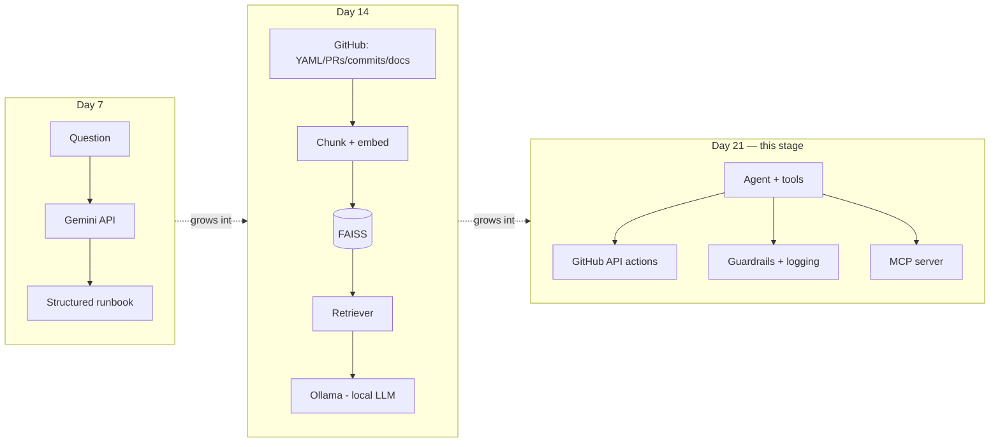

# 🚀 AI-Powered DevOps Release Assistant
<a href="https://github.com/saghosh8/ai-devops-release-assistants">
  
<a href="https://github.com/saghosh8/ai-devops-release-assistant/fork">
  
</a>

---

**A single assistant, growing across a 3-week AI/GenAI course — from a plain LLM Q&A tool (Day 7) to a RAG-powered retriever (Day 14) to a full agentic system with tools, security, and MCP (Day 21).**

> Part of the [21-day AI For DevOps course](https://github.com/saghosh8/AI-For-DevOps) — this repo is the hands-on project, with milestones added on Day 7, Day 14, and Day 21. If anything here is unclear, check the course repo first for the day-by-day writeups.

[](https://github.com/saghosh8/ai-devops-release-assistant/actions/workflows/tests.yml)
[](https://www.python.org/)
[](https://ai.google.dev/)
[](https://ollama.com/)
[](https://github.com/saghosh8/ai-devops-release-assistant/releases/tag/v1.0-day21)

---

## The three-milestone arc

This repo is intentionally **one evolving codebase**, not three separate projects. Each milestone is tagged so the growth is visible in the git history — which is the point: the same assistant gains capabilities each week rather than being rebuilt from scratch.

| Tag | Week | What it adds | Status |
| --- | ---- | ------------- | ------ |
| [`v0.1-day7`](https://github.com/saghosh8/ai-devops-release-assistant/releases/tag/v0.1-day7) | Week 1 | Plain LLM Q&A → structured runbook | ✅ Done |
| [`v0.2-day14`](https://github.com/saghosh8/ai-devops-release-assistant/releases/tag/v0.2-day14) | Week 2 | RAG: ingest real GitHub docs/PRs/commits/YAML from 3 live repos → chunk → embed → FAISS → retrieve → answer with a local Ollama model | ✅ Done |
| `v1.0-day21` | Week 3 | Full agent: tool-use against the real GitHub API, prompt-injection/PII guardrails, cost/latency logging, MCP server exposing this assistant's tools | ✅ Current |



See [`ROADMAP.md`](ROADMAP.md) for exactly what each milestone added, module by module,
and [`INTERVIEW_PREP.md`](INTERVIEW_PREP.md) for the Day 21 prep Q&A.

---

## What this stage (Day 21) is

The Day 14 RAG pipeline is still here, unchanged — `search_repo_history` in `agent.py`
calls it directly. What's new is a **planning loop** (`agent.py`) that can, across
multiple steps, decide to search that repo history, call a real GitHub API tool, run one
of this project's own deterministic analysis functions, or answer directly. It has real
read access to PRs, issues, workflow runs, jobs, logs, and commits across
[`release-automation`](https://github.com/saghosh8/release-automation), `application-one`,
and `application-two`. It has exactly one class of *write* action — re-running a workflow
or commenting on an issue — and neither ever executes without an explicit human approval
step; the model can only propose them.

Three ways to run it:

1. **Locally**, as a CLI: `python -m devops_assistant agent "<question>"`
2. **Entirely inside GitHub**, via the **"Run Agent"** `workflow_dispatch` Action — type a
   question, pick which repo it's mainly about, optionally auto-approve write actions, get
   the answer and tool-call transcript in the run summary.
3. **Over MCP**, via `python -m devops_assistant.mcp_server` — every tool below is
   reachable from Claude Desktop, Claude Code, or any other MCP-compatible client.

## Why it's built this way

- **Manual, not automatic, function calling.** Gemini's SDK can execute tool calls
  invisibly and loop on its own (see `tools.py`'s `get_utc_time` demo) — but that gives no
  seam for a human-approval step. `agent.py` runs its own explicit loop instead, precisely
  so a proposed write action can be intercepted and confirmed before the real GitHub API
  is ever called.
- **Composite tools over raw data.** `diagnose_workflow_run`, `review_pull_request`,
  `analyze_recent_commits`, and `troubleshoot_latest_failed_run` each fetch GitHub data
  *and* run this project's own analysis logic (`analysis/`) in one tool call, rather than
  making the model reconstruct that reasoning itself from raw API responses every time.
- **Every tool result is sanitized before the model sees it again.** `security.py` scans
  for secrets and PII and runs an injection check on tool output specifically — a PR body
  or log line is attacker-reachable content in a way the user's own question generally
  isn't, so it gets the stricter treatment (see `INTERVIEW_PREP.md`'s security section).
- **The write-tool gate lives in `github_tools.py` itself, not just in the agent.**
  `rerun_workflow(..., approved=False)` raises `ApprovalRequiredError` by default no
  matter who calls it — the MCP server exposes that same `approved` parameter directly
  rather than hiding it, so the gate holds regardless of which client is calling.

## Project structure

```
ai-devops-release-assistant/
├── devops_assistant/
│   ├── client.py            # Day 7: Gemini API calls, retries, streaming, tool-use loop
│   ├── prompts.py           # Day 7: system prompts + JSON schema + scope guardrail
│   ├── tools.py              # Day 7: one real tool-use example (get_utc_time)
│   ├── memory.py             # Day 7: local history + context-window management
│   ├── formatter.py          # Day 7: terminal (ANSI) and Markdown renderers
│   ├── cli.py                 # Day 7 + 21: argparse CLI: ask / stream / tools-demo / history / agent
│   ├── rag/
│   │   ├── ingest.py          # Day 9: pulls YAML/PRs/commits/README from real repos via GitHub API
│   │   ├── embeddings.py      # Day 10: Sentence Transformers embedder
│   │   ├── vectorstore.py     # Day 11: FAISS index
│   │   ├── retriever.py       # Day 12: build_index + top-K retrieval, source_type filter
│   │   ├── rag_client.py      # Day 13: prompt construction + Ollama generation
│   │   └── ask_rag.py         # Day 14: CLI entry point
│   ├── agent.py               # Day 15: planning loop — manual function calling + human-approval gate
│   ├── github_tools.py        # Day 16: real GitHub API read tools + 2 approval-gated write tools
│   ├── analysis/
│   │   ├── pr_review.py               # Day 17: PR risk scoring
│   │   ├── commit_analysis.py         # Day 17: revert/fix-streak detection
│   │   ├── ci_failure_analysis.py     # Day 17: failed-job + log correlation
│   │   ├── log_analysis.py            # Day 17: regex error-signature extraction
│   │   └── deployment_troubleshooting.py  # Day 17: run + commit + PR correlation
│   ├── security.py            # Day 18: secret/PII scanning, redaction, OWASP LLM Top 10 map
│   ├── observability.py       # Day 19: cost/latency logging, prompt versioning, eval set
│   └── mcp_server.py          # Day 20: exposes 19 tools over MCP
├── tests/                     # pytest — everything mocked, no network/API key needed in CI
├── .github/workflows/
│   ├── ask-devops-assistant.yml   # Day 7 demo runner
│   ├── ask-rag-demo.yml           # Day 14 demo runner — "Ask RAG Anything"
│   ├── agent-demo.yml             # Day 21 demo runner — "Run Agent"
│   └── tests.yml                  # CI on push/PR
├── requirements.txt
├── requirements-rag.txt
├── requirements-agent.txt
├── requirements-dev.txt
├── .env.example
├── ROADMAP.md
├── INTERVIEW_PREP.md
└── README.md
```

## Setup

```
git clone https://github.com/YOUR_USERNAME/ai-devops-release-assistant.git
cd ai-devops-release-assistant
pip install -r requirements-agent.txt   # covers the agent + RAG + MCP server
export GEMINI_API_KEY=...               # agent reasoning
export GITHUB_TOKEN=ghp_...             # only needed for private repos or write actions;
                                         # public read access works unauthenticated (lower rate limit)
```

## Usage — the agent

```
# Ask the agent to investigate (it decides which tools to call)
python -m devops_assistant agent "why did the last workflow run fail on application-one?"

# See every tool call it made, in order
python -m devops_assistant agent "..." --verbose

# Auto-approve any write action it proposes instead of an interactive y/n prompt
# (only for non-interactive contexts you already trust, e.g. CI)
python -m devops_assistant agent "..." --approve-writes

# Full result — answer, tool calls, args, results — as JSON
python -m devops_assistant agent "..." --json

# Use the smaller/cheaper model
python -m devops_assistant agent "..." --model gemini-3.5-flash-lite
```

## Usage — the MCP server

```
python -m devops_assistant.mcp_server                      # stdio, for Claude Desktop/Code config
python -m devops_assistant.mcp_server --transport sse --port 8787
```

Point an MCP client at it (stdio: `python -m devops_assistant.mcp_server`; sse/streamable-
http: the host/port above) to get all 19 tools — every `github_tools.py` read/write tool,
the composite analysis tools, `search_repo_history`, and the original Day 7
`ask_devops_question` — from that client directly.

## Running the agent from GitHub, with nothing installed locally

1. Add `GEMINI_API_KEY` as a repository secret.
2. For write actions against `application-one`/`application-two` specifically (not this
   repo), also add a personal access token with `repo` + `actions` scope on those repos as
   a secret named `CROSS_REPO_TOKEN` — the default `GITHUB_TOKEN` only has write access to
   this repo. Read-only investigation works without this.
3. Go to the **Actions** tab → **Run Agent** → **Run workflow**.
4. Type your question, pick the repo it's mainly about, leave `approve_writes` off unless
   you want proposed actions to execute automatically.
5. Open the completed run — the answer and tool-call list are in the **Summary**; the full
   transcript (including sanitization warnings, if any) is attached as a build artifact.

## Running the Day 14 RAG pipeline directly

```
# Ask a question against the default configured repos (release-automation, application-one, application-two)
python -m devops_assistant.rag.ask_rag "why might the release workflow fail on the docker build step?"

# Rebuild the FAISS index first (needed on first run, or after repo content changes)
python -m devops_assistant.rag.ask_rag "..." --rebuild-index

# Restrict retrieval to one content type
python -m devops_assistant.rag.ask_rag "..." --filter pr

# Point at different repos entirely
python -m devops_assistant.rag.ask_rag "..." --repos owner/repo1 owner/repo2

# More retrieved chunks per query (default: 8)
python -m devops_assistant.rag.ask_rag "..." -k 12

# Markdown output (what the GitHub Action pipes into the run summary)
python -m devops_assistant.rag.ask_rag "..." --markdown
```

Or via the **"Ask RAG Anything"** GitHub Actions workflow (Actions tab) — no local setup
required, Ollama installs and runs inside the job.

## Testing

```
pip install -r requirements-dev.txt
pytest tests/ -v
```

Everything is mocked at the network boundary — a fake `requests` response for
`github_tools.py`, a fully scripted fake Gemini client for `agent.py`, a deterministic
fake embedder and mocked `ingest.load()` for the RAG tests. No model downloads, no GitHub
API calls, no LLM API key, no network dependency anywhere in CI.

## Design notes

- **Retrieval is decoupled from ingestion source.** `ingest.py` exposes a single `load()`
  returning `Document` objects; everything downstream (`retriever.py`, `rag_client.py`,
  and now `agent.py`'s `search_repo_history`) is agnostic to where those documents came
  from.
- **Failures during ingestion are logged, not swallowed.** Each GitHub API call that fails
  (auth, rate limit, wrong repo name) prints a `[ingest] WARNING` to stderr.
- **Analysis functions never call the GitHub API themselves.** Everything in `analysis/`
  is a plain `dict`-in/`dict`-out function, testable with fixture data alone — `agent.py`
  is the only place that wires live GitHub data into them.
- **The approval gate is enforced at the tool layer, not the caller layer.**
  `github_tools.rerun_workflow` and `comment_on_issue` refuse to act without
  `approved=True` regardless of whether they're called from `agent.py`'s model loop,
  `mcp_server.py`, or a test — there's exactly one place that decision is made.

## Scope note

Each milestone stuck to its own course week's concepts: Day 14 to RAG (ingestion through
grounded generation), Day 21 to agentic tool-use, security, observability, and MCP. The
`.github/workflows/` demo runners and the pytest CI workflow are the one deliberate
exception across all three — general delivery practice, not new concepts for that week,
added specifically so everything can be run and verified entirely via GitHub.
