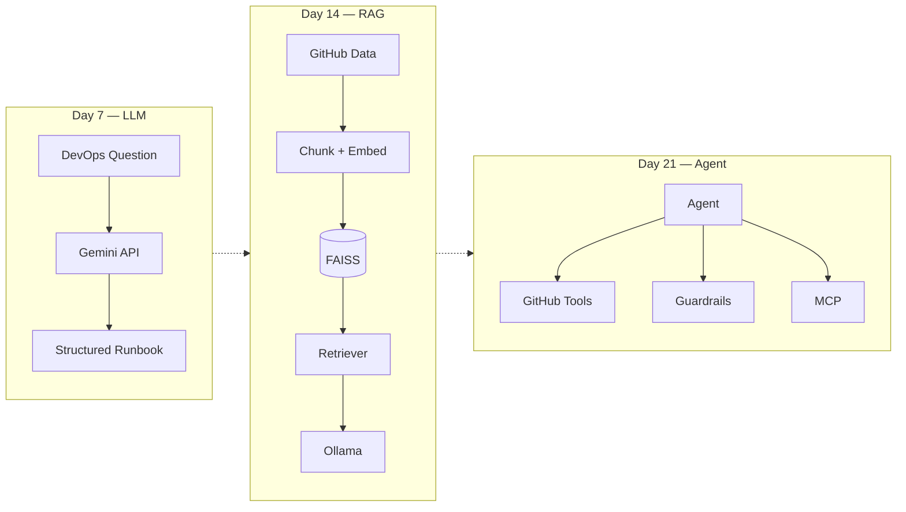

# 🚀 AI-Powered DevOps Release Assistant

A single DevOps assistant that evolves across a 3-week AI/GenAI journey — from a plain LLM Q&A tool on **Day 7**, to a RAG-powered retriever on **Day 14**, to a full agentic system with tools, security, observability, and MCP on **Day 21**.

<a href="https://github.com/saghosh8/ai-devops-release-assistant">
  
<a href="https://github.com/saghosh8/ai-devops-release-assistant/fork">
  
</a>
  
---

**A single assistant, growing across a 3-week AI/GenAI course — from a plain LLM Q&A tool (Day 7) to a RAG-powered retriever (Day 14) to a full agentic system with tools, security, and MCP (Day 21).**

> Part of the [21-day AI For DevOps course](https://github.com/saghosh8/AI-For-DevOps) — this repo is the hands-on project, with milestones added on Day 7, Day 14, and Day 21. If anything here is unclear, check the course repo first for the day-by-day writeups.

[](https://github.com/saghosh8/ai-devops-release-assistant/actions/workflows/tests.yml)
[](https://www.python.org/)
[](https://ai.google.dev/)
[](https://ollama.com/)
[](https://github.com/saghosh8/ai-devops-release-assistant/releases/tag/v1.0-day21)

---


## The Three-Milestone Arc

This is intentionally **one evolving codebase**, not three separate projects.

The same assistant gains new capabilities at each milestone:

| Milestone                                                                               | Week   | What it adds                                                    | Status    |
| --------------------------------------------------------------------------------------- | ------ | --------------------------------------------------------------- | --------- |
| [`v0.1-day7`](https://github.com/saghosh8/ai-devops-release-assistant/tree/v0.1-day7)   | Week 1 | Plain LLM Q&A → structured DevOps runbook                       | ✅         |
| [`v0.2-day14`](https://github.com/saghosh8/ai-devops-release-assistant/tree/v0.2-day14) | Week 2 | RAG over GitHub documentation, PRs, commits and YAML            | ✅         |
| [`v0.3-day21`](https://github.com/saghosh8/ai-devops-release-assistant/tree/v0.3-day21) | Week 3 | Agentic tool-use, GitHub API, guardrails, observability and MCP | ✅         |



See [`ROADMAP.md`](ROADMAP.md) for the milestone-by-milestone implementation details and [`INTERVIEW_PREP.md`](INTERVIEW_PREP.md) for the Day 21 interview preparation.

---

# What the Assistant Can Do

The current Day 21 version can investigate real DevOps problems across GitHub repositories.

It can:

* Investigate failed GitHub Actions workflows
* Inspect workflow runs and jobs
* Analyze workflow logs
* Review pull requests
* Analyze recent commits
* Troubleshoot deployment failures
* Search repository history using the Day 14 RAG pipeline
* Propose GitHub actions such as rerunning a workflow
* Propose commenting on an issue
* Require human approval before write actions
* Detect secrets and PII
* Check tool output for prompt injection
* Track cost and latency
* Expose its tools through MCP

The assistant currently works with:

* `release-automation`
* `application-one`
* `application-two`

---

# Day 7 — LLM DevOps Assistant

The first milestone is a simple LLM-powered DevOps assistant.

The user asks a DevOps question, the assistant sends it to Gemini, and returns a structured response that can be used as a troubleshooting runbook.

### Day 7 capabilities

* Gemini API integration
* System prompts
* Structured JSON output
* Streaming responses
* Conversation history
* Context-window management
* Basic scope guardrails
* Tool calling example
* CLI interface
* GitHub Actions runner

## Running the Day 7 assistant directly

```bash
# Ask the DevOps assistant a question
python -m devops_assistant ask "why is my Kubernetes pod in CrashLoopBackOff?"

# Stream the response
python -m devops_assistant stream "explain this deployment failure"

# Run the tool-use demo
python -m devops_assistant tools-demo

# View conversation history
python -m devops_assistant history
```

Or use the **Ask DevOps Assistant** GitHub Actions workflow from the **Actions** tab — no local setup required.

---

# Day 14 — RAG-Powered DevOps Assistant

The second milestone gives the assistant access to real repository knowledge.

Instead of asking the LLM to answer from its general knowledge, the system:

1. Ingests GitHub repository content
2. Chunks the documents
3. Generates embeddings
4. Stores them in FAISS
5. Retrieves relevant chunks
6. Sends the retrieved context to a local Ollama model
7. Generates a grounded answer

The RAG pipeline can ingest:

* YAML files
* README/documentation
* Pull requests
* Commits

## Running the Day 14 RAG pipeline directly

```bash
# Ask a question against the default configured repositories
python -m devops_assistant.rag.ask_rag "why might the release workflow fail on the docker build step?"

# Rebuild the FAISS index
python -m devops_assistant.rag.ask_rag "..." --rebuild-index

# Restrict retrieval to one content type
python -m devops_assistant.rag.ask_rag "..." --filter pr

# Use different repositories
python -m devops_assistant.rag.ask_rag "..." --repos owner/repo1 owner/repo2

# Retrieve more chunks
python -m devops_assistant.rag.ask_rag "..." -k 12

# Return Markdown output
python -m devops_assistant.rag.ask_rag "..." --markdown
```

Or use the **Ask RAG Anything** GitHub Actions workflow from the **Actions** tab.

The workflow installs and runs Ollama inside the GitHub Actions job, so no local Ollama installation is required.

---

# Day 21 — Agentic DevOps Assistant

The final milestone turns the assistant into an agent.

The agent can decide which tools it needs to use to investigate a problem instead of following one fixed pipeline.

For example:

```text
User question
      ↓
Agent
      ↓
Decide what information is needed
      ↓
┌───────────────┬────────────────┬──────────────────┐
│ GitHub API    │ RAG search     │ Analysis tools   │
│               │                │                  │
│ PRs           │ Repo history   │ CI failures      │
│ Issues        │                │ PR risk           │
│ Workflows     │                │ Commits           │
│ Jobs          │                │ Deployments       │
│ Logs          │                │                  │
└───────────────┴────────────────┴──────────────────┘
      ↓
Sanitize + validate tool results
      ↓
Agent decides next step
      ↓
Answer / proposed action
```

### Day 21 capabilities

* Manual agent planning loop
* GitHub API tools
* Composite DevOps analysis tools
* Human approval for write actions
* Secret detection
* PII detection
* Prompt-injection checks
* Cost and latency logging
* Prompt versioning
* Evaluation set
* MCP server
* GitHub Actions execution

The Day 14 RAG pipeline is still part of the system. The agent can call `search_repo_history` when repository history is useful for answering a question.

---

## Running the Day 21 agent directly

```bash
# Ask the agent to investigate a DevOps issue
python -m devops_assistant agent \
  "why did the last workflow run fail on application-one?"

# See every tool call made by the agent
python -m devops_assistant agent "..." --verbose

# Auto-approve proposed write actions
python -m devops_assistant agent "..." --approve-writes

# Return the complete result as JSON
python -m devops_assistant agent "..." --json

# Use a smaller/cheaper model
python -m devops_assistant agent "..." --model gemini-3.5-flash-lite
```

### GitHub Actions

The agent can also run entirely inside GitHub.

1. Add `GEMINI_API_KEY` as a repository secret.
2. For write actions against `application-one` or `application-two`, add a token with the required permissions as `CROSS_REPO_TOKEN`.
3. Open the **Actions** tab.
4. Select **Run Agent**.
5. Enter the question and select the repository.
6. Run the workflow.
7. Open the completed workflow to see the answer and tool-call transcript.

No local installation is required.

---

# MCP Server

The Day 21 assistant can expose its tools through the Model Context Protocol.

Run the server locally:

```bash
python -m devops_assistant.mcp_server
```

Or run it using SSE:

```bash
python -m devops_assistant.mcp_server --transport sse --port 8787
```

The MCP server exposes the assistant's DevOps tools to MCP-compatible clients such as:

* Claude Desktop
* Claude Code
* Other MCP-compatible clients

The exposed tools include GitHub read/write tools, analysis tools, repository-history search, and the original Day 7 DevOps question tool.

---

# Why It Is Built This Way

## Manual agent loop

The agent uses an explicit planning loop rather than relying entirely on automatic SDK function calling.

This creates a clear point where a proposed write action can be intercepted and approved by a human.

## Composite DevOps tools

Instead of forcing the model to reconstruct complex analysis from raw GitHub API responses, the project provides higher-level tools such as:

* `diagnose_workflow_run`
* `review_pull_request`
* `analyze_recent_commits`
* `troubleshoot_latest_failed_run`

These tools combine GitHub data with deterministic analysis functions.

## Tool-result sanitization

Tool results are treated as untrusted input.

PR descriptions, commit messages, issue bodies, and workflow logs can contain attacker-controlled content, so tool output is scanned for:

* Secrets
* PII
* Prompt injection

before being passed back to the model.

## Write-action approval

Write operations are protected at the tool layer.

For example:

```python
rerun_workflow(..., approved=False)
```

will not execute the action unless explicit approval is provided.

This protection applies regardless of whether the tool is called through:

* The agent
* MCP
* Tests
* Another client

---

# Project Structure

```text
ai-devops-release-assistant/
├── devops_assistant/
│   ├── client.py            # Day 7: Gemini API calls, retries, streaming, tool-use loop
│   ├── prompts.py           # Day 7: system prompts + JSON schema + scope guardrail
│   ├── tools.py              # Day 7: one real tool-use example (get_utc_time)
│   ├── memory.py             # Day 7: local history + context-window management
│   ├── formatter.py          # Day 7: terminal (ANSI) and Markdown renderers
│   ├── cli.py                 # Day 7 + 21: argparse CLI: ask / stream / tools-demo / history / agent
│   ├── rag/
│   │   ├── ingest.py          # Day 9: pulls YAML/PRs/commits/README from real repos via GitHub API
│   │   ├── embeddings.py      # Day 10: Sentence Transformers embedder
│   │   ├── vectorstore.py     # Day 11: FAISS index
│   │   ├── retriever.py       # Day 12: build_index + top-K retrieval, source_type filter
│   │   ├── rag_client.py      # Day 13: prompt construction + Ollama generation
│   │   └── ask_rag.py         # Day 14: CLI entry point
│   ├── agent.py               # Day 15: planning loop — manual function calling + human-approval gate
│   ├── github_tools.py        # Day 16: real GitHub API read tools + 2 approval-gated write tools
│   ├── analysis/
│   │   ├── pr_review.py               # Day 17: PR risk scoring
│   │   ├── commit_analysis.py         # Day 17: revert/fix-streak detection
│   │   ├── ci_failure_analysis.py     # Day 17: failed-job + log correlation
│   │   ├── log_analysis.py            # Day 17: regex error-signature extraction
│   │   └── deployment_troubleshooting.py  # Day 17: run + commit + PR correlation
│   ├── security.py            # Day 18: secret/PII scanning, redaction, OWASP LLM Top 10 map
│   ├── observability.py       # Day 19: cost/latency logging, prompt versioning, eval set
│   └── mcp_server.py          # Day 20: exposes 19 tools over MCP
├── tests/                     # pytest — everything mocked, no network/API key needed in CI
├── .github/workflows/
│   ├── ask-devops-assistant.yml   # Day 7 demo runner
│   ├── ask-rag-demo.yml           # Day 14 demo runner — "Ask RAG Anything"
│   ├── agent-demo.yml             # Day 21 demo runner — "Run Agent"
│   └── tests.yml                  # CI on push/PR
├── requirements.txt
├── requirements-rag.txt
├── requirements-agent.txt
├── requirements-dev.txt
├── .env.example
├── ROADMAP.md
├── INTERVIEW_PREP.md
└── README.md

```

---

# Setup

Clone the repository:

```bash
git clone https://github.com/saghosh8/ai-devops-release-assistant.git
cd ai-devops-release-assistant
```

Install the complete Day 21 dependencies:

```bash
pip install -r requirements-agent.txt
```

Set the required environment variables:

```bash
export GEMINI_API_KEY=...
export GITHUB_TOKEN=...
```

`GITHUB_TOKEN` is required for authenticated GitHub access and write actions.

Public repositories can be read without authentication, although unauthenticated requests have lower GitHub API rate limits.

---

# Testing

Install the development dependencies:

```bash
pip install -r requirements-dev.txt
```

Run the tests:

```bash
pytest tests/ -v
```

The tests mock external services at the network boundary.

No following are required to run the test suite:

* GitHub API access
* Gemini API key
* Model downloads
* Network access

---

# Design Notes

### Retrieval is decoupled from ingestion

`ingest.py` produces `Document` objects.

Everything downstream can work with those documents without needing to know where they came from.

### Analysis is deterministic

The functions under `analysis/` operate on structured data and do not call the GitHub API themselves.

This keeps the analysis logic independently testable.

### GitHub access is centralized

The agent is responsible for connecting live GitHub data with the analysis functions.

### Approval is enforced at the tool layer

Write tools refuse to execute unless approval is explicitly provided.

This means the safety mechanism remains active regardless of how the tool is accessed.

---

# Course Progression

The repository follows the 21-day AI for DevOps learning path:

```text
Week 1 — LLM Foundations
        ↓
Day 7 — LLM DevOps Assistant
        ↓
Week 2 — RAG
        ↓
Day 14 — RAG DevOps Assistant
        ↓
Week 3 — Agents + MCP + LLMOps
        ↓
Day 21 — Agentic DevOps Assistant
```

The goal is not to build three disconnected demos.

The goal is to show how a **single DevOps assistant evolves as new AI concepts are introduced**.

---

# Milestone Summary

|                      | Day 7 | Day 14 | Day 21 |
| -------------------- | ----- | ------ | ------ |
| LLM                  | ✅     | ✅      | ✅      |
| Structured output    | ✅     | ✅      | ✅      |
| Conversation history | ✅     | ✅      | ✅      |
| RAG                  | —     | ✅      | ✅      |
| Embeddings           | —     | ✅      | ✅      |
| FAISS                | —     | ✅      | ✅      |
| GitHub data          | —     | ✅      | ✅      |
| Agent loop           | —     | —      | ✅      |
| GitHub tools         | —     | —      | ✅      |
| DevOps analysis      | —     | —      | ✅      |
| Security guardrails  | —     | —      | ✅      |
| Human approval       | —     | —      | ✅      |
| Observability        | —     | —      | ✅      |
| MCP                  | —     | —      | ✅      |

---

# Scope

Each milestone focuses on the concepts introduced during that stage of the course:

* **Day 7:** LLM fundamentals and DevOps Q&A
* **Day 14:** RAG — ingestion, embeddings, retrieval and grounded generation
* **Day 21:** Agentic tool-use, security, observability and MCP

The GitHub Actions workflows and automated tests are shared infrastructure across the milestones so the project can be run and verified entirely through GitHub.

---

## ⭐ Explore the Project

If you find this useful:

⭐ Star the repository
🍴 Fork it
💬 Open an issue or discussion with ideas and feedback

The project is built as a learning journey, so the Git history is part of the story.
