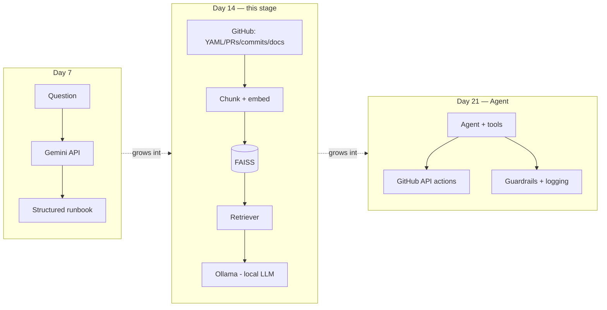

# 🚀 AI-Powered DevOps Release Assistant
<a href="https://github.com/saghosh8/ai-devops-release-assistants">
  
<a href="https://github.com/saghosh8/ai-devops-release-assistant/fork">
  
</a>

---

**A single assistant, growing across a 3-week AI/GenAI course — from a plain LLM Q&A tool (Day 7) to a RAG-powered retriever (Day 14) to a full agentic system with tools, security, and MCP (Day 21).**

> Part of the [21-day AI For DevOps course](https://github.com/saghosh8/AI-For-DevOps) — this repo is the hands-on project, with milestones added on Day 7, Day 14, and Day 21. If anything here is unclear, check the course repo first for the day-by-day writeups.

[](https://github.com/saghosh8/ai-devops-release-assistant/actions/workflows/tests.yml)
[](https://www.python.org/)
[](https://ai.google.dev/)
[](https://ollama.com/)
[](https://github.com/saghosh8/ai-devops-release-assistant/releases/tag/v0.2-day14)

---

## The three-milestone arc

This repo is intentionally **one evolving codebase**, not three separate projects. Each milestone is tagged so the growth is visible in the git history — which is the point: the same assistant gains capabilities each week rather than being rebuilt from scratch.

| Tag | Week | What it adds | Status |
| --- | ---- | ------------- | ------ |
| [`v0.1-day7`](https://github.com/saghosh8/ai-devops-release-assistant/releases/tag/v0.1-day7) | Week 1 | Plain LLM Q&A → structured runbook | ✅ Done |
| [`v0.2-day14`](https://github.com/saghosh8/ai-devops-release-assistant/releases/tag/v0.2-day14) | Week 2 | RAG: ingest real GitHub docs/PRs/commits/YAML from 3 live repos → chunk → embed → FAISS → retrieve → answer with a local Ollama model | ✅ Current |
| `v1.0-day21` | Week 3 | Full agent: tool-use against the real GitHub API, prompt-injection/PII guardrails, cost/latency logging, MCP server exposing this assistant's tools | 🔜 Planned |



See [`ROADMAP.md`](ROADMAP.md) for exactly what Day 14 added and what Day 21 will add, module by module.

---

## What this stage (Day 14) is

A RAG pipeline bolted onto the Day 7 assistant, so it can answer questions grounded in **real, live repo content** instead of just what the model already knows. It ingests from three actual GitHub repos — [`release-automation`](https://github.com/saghosh8/release-automation), `application-one`, `application-two` — pulling workflow YAML, PR titles/bodies, commit messages, and README docs via the GitHub REST API. That content is chunked, embedded, indexed in FAISS, and the top-matching chunks are retrieved to ground an answer generated by a **local Ollama model** — no paid LLM API key required for this stage.

Two ways to run it:

1. **Locally**, as a CLI: `python -m devops_assistant.rag.ask_rag "<question>"`
2. **Entirely inside GitHub**, via the **"Ask RAG Anything"** `workflow_dispatch` Action — type a question, optionally filter by content type (`yaml` / `pr` / `commit` / `doc`), get a cited answer in the run summary. Ollama installs and runs inside the job itself.

## Why it's built this way

- **Real repos, not fixture data.** Early versions of this pipeline ingested from a small local `sample_repo_data/` folder — enough to prove the pipeline worked, but not representative of an actual project. That's been replaced entirely; `ingest.py` now only pulls live from GitHub.
- **Ingestion is swappable, retrieval isn't coupled to it.** `retriever.py`, `embeddings.py`, and `vectorstore.py` only ever see `Document` objects — they don't know or care that those came from the GitHub API instead of local files. That's what let the sample-data → live-repo swap happen without touching retrieval logic at all.
- **Local generation.** Ollama runs a small model (`llama3.2:1b`) locally instead of calling a paid API for the generation step, so the whole RAG loop — including in CI — needs nothing but a GitHub token.

## Project structure

```
ai-devops-release-assistant/
├── devops_assistant/
│   ├── client.py            # Day 7: Gemini API calls, retries, streaming, tool-use loop
│   ├── prompts.py           # Day 7: system prompts + JSON schema + scope guardrail
│   ├── tools.py              # Day 7: one real tool-use example (get_utc_time)
│   ├── memory.py             # Day 7: local history + context-window management
│   ├── formatter.py          # Day 7: terminal (ANSI) and Markdown renderers
│   ├── cli.py                 # Day 7: argparse CLI: ask / stream / tools-demo / history
│   └── rag/
│       ├── ingest.py          # Day 9: pulls YAML/PRs/commits/README from real repos via GitHub API
│       ├── embeddings.py      # Day 10: Sentence Transformers embedder
│       ├── vectorstore.py     # Day 11: FAISS index
│       ├── retriever.py       # Day 12: build_index + top-K retrieval, source_type filter
│       ├── rag_client.py      # Day 13: prompt construction + Ollama generation
│       └── ask_rag.py         # Day 14: CLI entry point
├── tests/                     # pytest — retriever tests use a fake embedder + mocked ingest, no network
├── .github/workflows/
│   ├── ask-devops-assistant.yml   # Day 7 demo runner
│   ├── ask-rag-demo.yml           # Day 14 demo runner — "Ask RAG Anything"
│   └── tests.yml                  # CI on push/PR
├── requirements.txt
├── requirements-rag.txt
├── .env.example
└── README.md
```

## Setup

```
git clone https://github.com/YOUR_USERNAME/ai-devops-release-assistant.git
cd ai-devops-release-assistant
pip install -r requirements-rag.txt
export GITHUB_TOKEN=ghp_...   # only needed for private repos; public repos work unauthenticated (lower rate limit)
```

Ollama needs to be installed and running locally if you're using the CLI directly (`curl -fsSL https://ollama.com/install.sh | sh` then `ollama pull llama3.2:1b`). The GitHub Actions workflow installs and starts it for you automatically.

## Usage

```
# Ask a question against the default configured repos (release-automation, application-one, application-two)
python -m devops_assistant.rag.ask_rag "why might the release workflow fail on the docker build step?"

# Rebuild the FAISS index first (needed on first run, or after repo content changes)
python -m devops_assistant.rag.ask_rag "..." --rebuild-index

# Restrict retrieval to one content type
python -m devops_assistant.rag.ask_rag "..." --filter pr

# Point at different repos entirely
python -m devops_assistant.rag.ask_rag "..." --repos owner/repo1 owner/repo2

# More retrieved chunks per query (default: 8)
python -m devops_assistant.rag.ask_rag "..." -k 12

# Markdown output (what the GitHub Action pipes into the run summary)
python -m devops_assistant.rag.ask_rag "..." --markdown
```

## Running it from GitHub, with nothing installed locally

1. If the target repos are private, add a fine-grained personal access token (Contents + Pull requests, read-only, scoped to those repos) as a secret named `GH_PAT`. Public repos work without this.
2. Go to the **Actions** tab → **Ask RAG Anything** → **Run workflow**.
3. Type your question, optionally pick a content-type filter (`all` searches everything).
4. Open the completed run — the answer and its cited sources are rendered in the **Summary**.

## Testing

```
pip install -r requirements-dev.txt
pytest tests/ -v
```

RAG tests use a deterministic fake embedder and a mocked `ingest.load()` — no model downloads, no GitHub API calls, no network dependency in CI.

## Design notes

- **Retrieval is decoupled from ingestion source.** `ingest.py` exposes a single `load()` returning `Document` objects; everything downstream (`retriever.py`, `rag_client.py`) is agnostic to where those documents came from. This is what made moving from local fixture data to live GitHub repos a one-file change.
- **Failures during ingestion are logged, not swallowed.** Each GitHub API call that fails (auth, rate limit, wrong repo name) prints a `[ingest] WARNING` to stderr, and `load()` logs a per-repo document count breakdown by content type — so a silently-empty repo is visible in the Actions log instead of just producing thin, low-confidence answers with no explanation.
- **Local generation, not a paid API, for this stage.** Ollama keeps the RAG loop runnable in CI with only a GitHub token — no LLM API key needed until later milestones bring back Gemini for agent reasoning.

## Scope note

This milestone sticks to Week 2, Days 8–14 for every RAG concept — document ingestion, chunking, embeddings, vector storage, retrieval, and grounded generation. The `.github/workflows/` demo runner and the pytest CI workflow are the one deliberate exception: general delivery/engineering practice, not new RAG concepts, added specifically to satisfy "shown entirely via GitHub."
